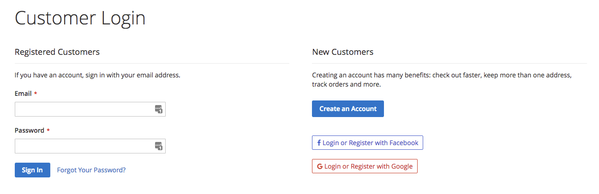
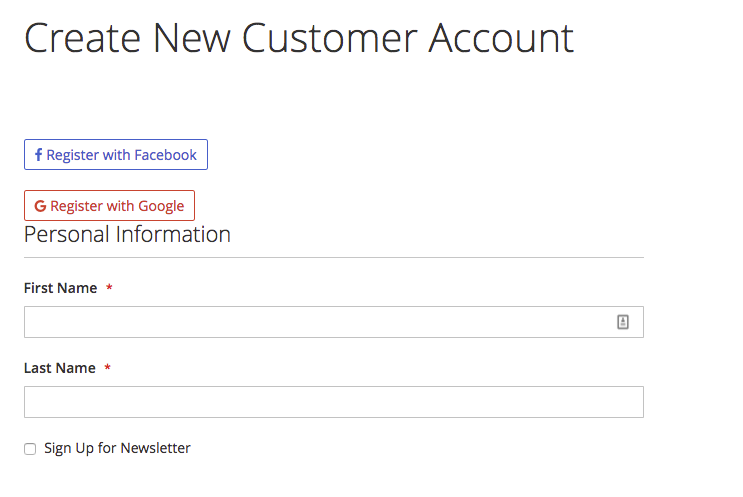

# Magento2 Social Login

This extension allows people to login and register through a social network account in your Magento 2 Store. I created this extension to fit my needs.

This extension was made from scratch using the javascript SDK of Facebook and Google API

## Social Networks Supported
- [Facebook](https://developers.facebook.com/apps)
- [Google](https://code.google.com/apis/console/)

### Prerequisites

- Magento 2 (2.0.x or 2.1.x and above) Installed.
- An app registered in Facebook or Google.

### Installing

- Create "app/code/Pekebyte/SocialLogin" folder.
- Clone or download this repository into "Pekebyte/SocialLogin" folder. 
- Run `php bin/magento module:enable Pekebyte_SocialLogin`
- Run `php bin/magento setup:upgrade`
- Run `php bin/magento setup:di:compile`
- Run `php bin/magento setup:static-content:deploy --area="frontend"`

## Usage

For configuration options on the admin dashboard, go to: "**Stores -> Configuration -> Customers -> Social Login**". And then make sure to enable the plugin on General Section.

## Screenshots
Description | Screenshot
------------ | -------------
Login Page |
Register Page | 

## Authors

* **Pedro Molina** - *Initial work* - [pekebyte](https://github.com/pekebyte)

See also the list of [contributors](https://github.com/your/project/contributors) who participated in this project.

## License

This project is licensed under the MIT License - see the [LICENSE.md](LICENSE.md) file for details

## Acknowledgments

* This plugin was inspired  by **[mageplaza/magento-2-social-login](https://github.com/mageplaza/magento-2-social-login)**
* This plugin uses **[fontawesome](http://fontawesome.io/)**